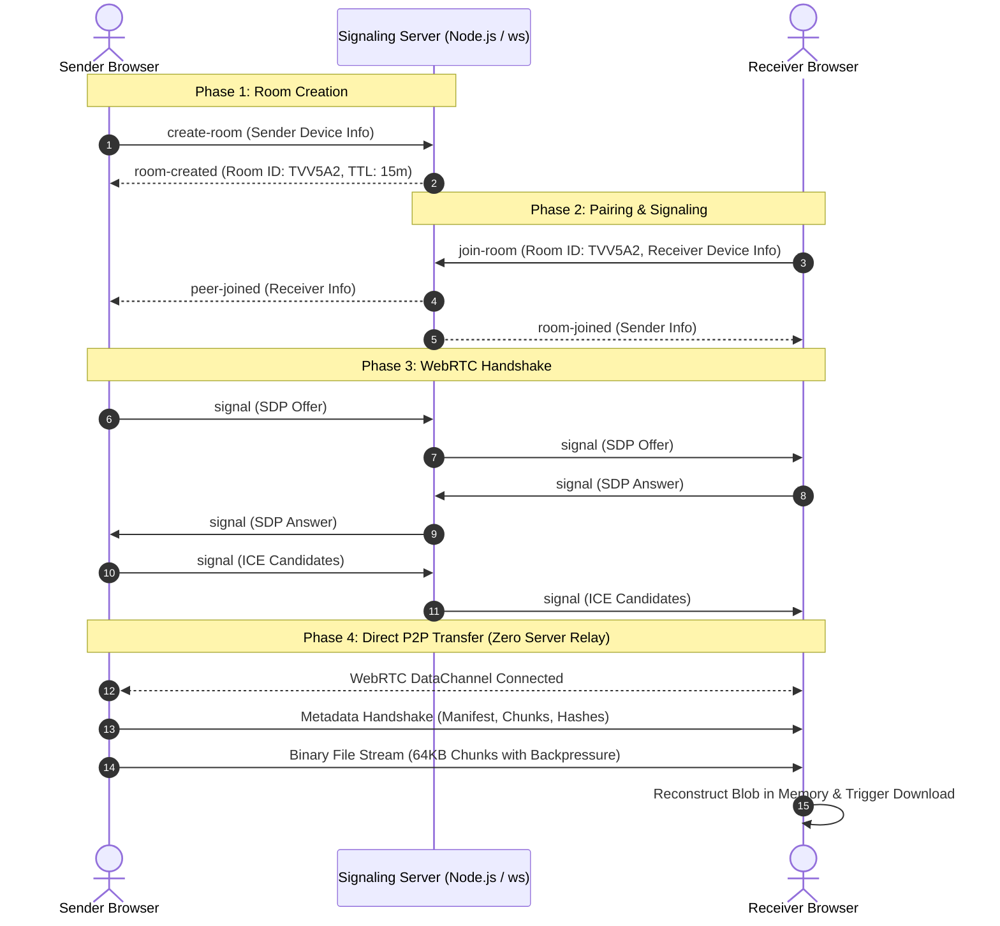

# ByteSend

<p align="center">
  
  
  
  
  
  
  
  
</p>

<p align="center">
  Direct, serverless peer-to-peer file transfer between devices using WebRTC DataChannel.<br />
  No cloud uploads. No file size restrictions. End-to-end memory streaming.
</p>

---

## Overview

**ByteSend** is a peer-to-peer (P2P) file transfer web application built to stream files directly between two web browsers. By establishing a direct WebRTC DataChannel connection facilitated by a lightweight WebSocket signaling coordinator, ByteSend eliminates the need for intermediate cloud storage. File payloads stream straight from the sender device memory or disk to the receiver device storage.

Connection pairing uses an unambiguous 6-character room code or an instantaneous QR code scan, removing friction across mobile and desktop environments.

---

## Key Features

- **Direct P2P Data Streaming**: Browser-to-browser data transfer powered by WebRTC SCTP DataChannels. Files never touch any server disk or memory.
- **Zero Cloud Storage**: True zero-knowledge architecture. The signaling coordinator only relays SDP offers, answers, and ICE candidate metadata.
- **Unambiguous 6-Character Room Codes**: Cryptographically generated alphanumeric codes excluding easily confused characters (`0`, `O`, `1`, `I`).
- **Instant QR Code Pairing**: On-screen dynamic QR code generation for camera pairing from mobile devices.
- **Adaptive Backpressure & Flow Control**: Chunk-based file streaming (64 KB chunks) with `bufferedAmountLowThreshold` monitoring to prevent browser memory exhaustion during large transfers.
- **Transfer Controls**: Real-time speed calculation, ETA estimation, individual and bulk progress tracking, with support for pause, resume, and cancellation.
- **Room Expiration Safeguard**: 15-minute room TTL with an automated modal notification that redirects users to the home screen upon expiration.
- **Responsive Dark Interface**: Engineered with an Obsidian/Zinc aesthetic, double-bezel styling, touch-friendly interactions, and stable scroll gutters.

---

## Architecture



---

## Tech Stack

### Client

| Technology | Purpose |
| :--- | :--- |
| **React 18** | Component architecture and state management |
| **TypeScript** | Strict type safety for data models and protocols |
| **Vite 6** | Build tooling, fast HMR, and production bundling |
| **Tailwind CSS** | Styling framework with custom design tokens |
| **Lucide Icons** | SVG icon system |
| **QRCode** | Canvas-based QR code generation for room codes |
| **Canvas Confetti** | Visual celebration trigger upon transfer completion |

### Server

| Technology | Purpose |
| :--- | :--- |
| **Node.js** | Server runtime |
| **ws** | Lightweight WebSocket server implementation |
| **tsx** | TypeScript execution and live reload for server development |
| **STUN Protocol** | Public Google STUN servers (`stun.l.google.com:19302`) for NAT traversal |

---

## Getting Started

### Prerequisites

- **Node.js**: v18.0.0 or higher
- **npm**: v9.0.0 or higher

### Installation

Clone the repository and install all dependencies:

```bash
git clone https://github.com/your-username/bytesend.git
cd bytesend
npm install
```

Install server dependencies:

```bash
cd server
npm install
cd ..
```

---

## Running Locally

### Development Mode

Run both the Vite frontend client and the WebSocket signaling server concurrently with a single command:

```bash
npm run dev
```

The services will initialize at:

- **Web Application**: `http://localhost:5173`
- **Signaling Server**: `http://localhost:3001`
- **Signaling WebSocket Endpoint**: `ws://localhost:3001/ws`
- **Health Check Endpoint**: `http://localhost:3001/health`

### Individual Services

To run components separately in different terminal windows:

```bash
# Frontend client only
npm run dev:client

# Signaling server only
npm run dev:server
```

---

## Production Build

Compile and bundle both client and server assets:

```bash
# Type check and build client bundle
npm run build

# Build server TypeScript files
npm run build:server
```

The optimized client assets are output to the `dist/` directory.

To start the standalone production server:

```bash
npm run start
```

---

## Project Structure

```
ByteSend/
├── index.html                   # HTML entry point with metadata
├── package.json                 # Project scripts and dependencies
├── postcss.config.js            # PostCSS configuration
├── tailwind.config.js           # Design system tokens and extensions
├── tsconfig.json                # Frontend TypeScript configuration
├── tsconfig.node.json           # Vite node configuration
├── vite.config.ts               # Vite configuration
│
├── server/                      # Lightweight Signaling Server
│   ├── package.json             # Server dependencies
│   ├── tsconfig.json            # Server TypeScript configuration
│   └── src/
│       ├── rooms.ts             # Room manager, safe code generator, 15m TTL
│       ├── server.ts            # HTTP server, health check, entry point
│       ├── types.ts             # Protocol interfaces and message types
│       └── websocket.ts         # WebSocket connection handling and routing
│
└── src/                         # Frontend Application Source
    ├── App.tsx                  # Root layout, navigation bar, view router
    ├── index.css                # Custom scrollbar styles and Tailwind directives
    ├── main.tsx                 # React DOM mount point
    │
    ├── components/
    │   ├── file/
    │   │   ├── FileDropzone.tsx # Drag-and-drop zone and file picker
    │   │   ├── FileItem.tsx     # Individual file status and progress item
    │   │   └── FileList.tsx     # Bounded, scrollable file selection list
    │   ├── room/
    │   │   ├── ConnectionStatus.tsx # Visual radar state for signaling and WebRTC
    │   │   ├── QRCodeModal.tsx      # QR code presentation modal
    │   │   ├── RoomCode.tsx         # Optical centered code display and actions
    │   │   └── RoomExpiredModal.tsx # Centered session timeout alert modal
    │   ├── transfer/
    │   │   ├── FileTransferCard.tsx # Active transfer monitor with pause/cancel
    │   │   └── TransferComplete.tsx # Completion view with download actions
    │   └── ui/
    │       ├── badge.tsx        # Status pill badge component
    │       ├── button.tsx       # Standardized tactile button component
    │       ├── card.tsx         # Doppelrand container component
    │       └── progress.tsx     # Animated progress bar component
    │
    ├── hooks/
    │   └── useDropCode.ts       # Unified transfer coordinator hook (useByteSend)
    │
    ├── services/
    │   ├── fileTransfer.ts      # Chunking engine, backpressure flow control
    │   ├── signaling.ts         # WebSocket client with heartbeat resilience
    │   └── webrtc.ts            # RTCPeerConnection and DataChannel manager
    │
    ├── types/
    │   ├── signaling.ts         # Message schema contracts
    │   └── transfer.ts          # File states and transfer metrics
    │
    └── utils/
        ├── device.ts            # OS and device type detection
        └── format.ts            # Byte size and countdown string formatters
```

---

## Data Streaming & Flow Control

To transmit files of any size without crashing browser tabs, ByteSend implements chunking and backpressure control:

1. **Chunk Slicing**: Files are read in slices of 64 KB using the browser `FileReader` or Blob slice API.
2. **Backpressure Thresholds**: The `RTCDataChannel.bufferedAmount` buffer is continuously checked.
   - When buffer usage exceeds the **High Watermark (1 MB)**, transmission yields.
   - When the buffer drops below the **Low Watermark (256 KB)**, transmission resumes via the `bufferedamountlow` event listener.
3. **Payload Sequencing**: Each chunk is prepended with a 16-byte binary header containing:
   - File Index (`Uint32`, 4 bytes)
   - Chunk Index (`Uint32`, 4 bytes)
   - Total Chunks (`Uint32`, 4 bytes)
   - Payload Length (`Uint32`, 4 bytes)
4. **Assembly**: The receiving browser gathers chunks sequentially and reconstructs the completed file into a standard Blob object with its original MIME type preserved.

---

## Security Model

- **No Data Retention**: The signaling server holds zero file content, hashes, or logs of transfer activity.
- **Transport Encryption**: All WebRTC DataChannels are mandated by standard to encrypt communication using Datagram Transport Layer Security (DTLS).
- **Session Ephemerality**: Rooms expire automatically 15 minutes after creation. Idle rooms are removed and memory is purged by the server garbage collection routine.
- **Safe Room Codes**: Character ambiguity is eliminated by removing confusing glyphs (`0` vs `O`, `1` vs `I`).

---
